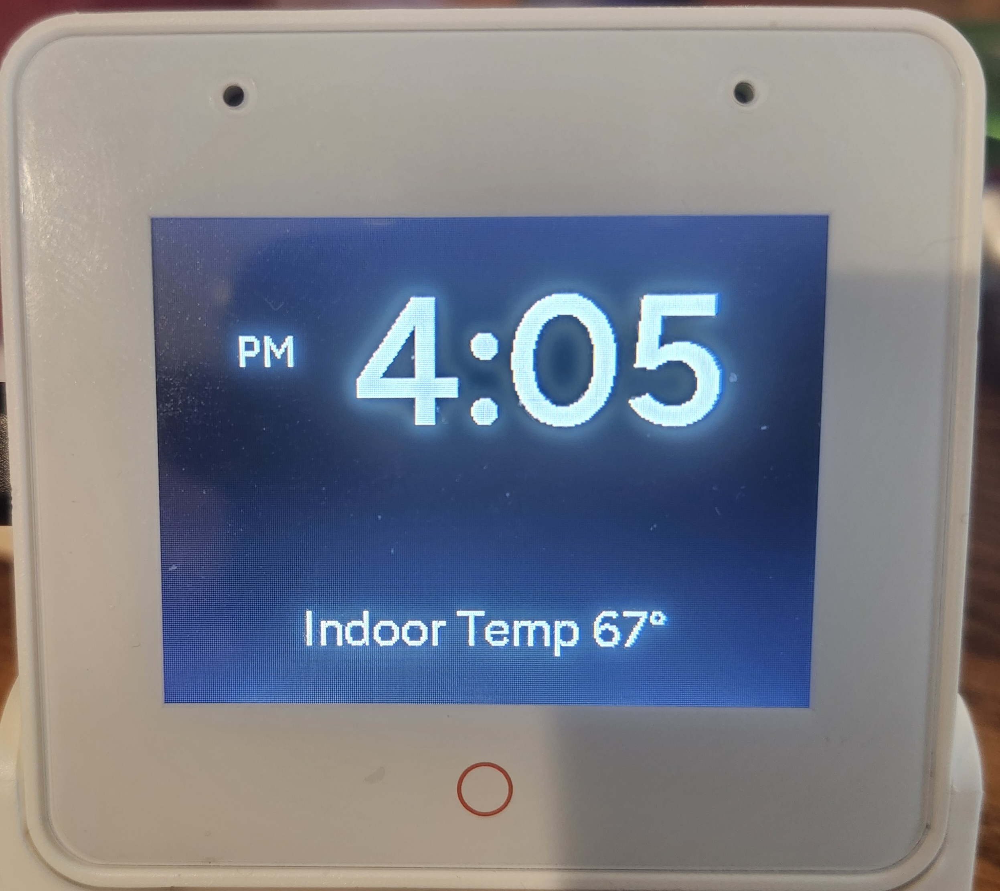

# ESP32-S3-Box-3 Custom Voice Assistant Display

This repository contains a **custom ESPHome package** for the **ESP32-S3-Box-3**, designed for use as a **Home Assistant Voice Assistant satellite**.

The goal of this project is to provide a **clean, minimal, and informative display** by removing unnecessary UI elements and adding useful, always-visible information when the device is idle.

---

## ✨ Features

### 🧼 Clean Display Layout
- Removes the default **top and bottom text boxes (bubbles)**
- Uses **full-screen custom illustrations** for all voice assistant states
- Clean, distraction-free interface designed for wall or desk placement

---

### 🕒 Idle Screen (Clock, Temperature & HVAC Status)
When the voice assistant is idle, the display shows:
- A **large, centered digital clock**
- **Indoor temperature** pulled directly from Home Assistant
- **HVAC system status icon**
  - 🔥 Heating
  - ❄️ Cooling
  - Hidden when idle
- Optional **blinking colon**
- Optional **AM/PM indicator** (12-hour mode only)

The display automatically returns to this screen after voice interactions complete.

---

### 🎛 Clock Controls (No Reflash Required)
After flashing, Home Assistant exposes configuration controls:
- 12-hour / 24-hour time format toggle
- AM/PM display toggle (12-hour mode only)
- AM/PM **horizontal offset slider**
- AM/PM **vertical offset slider**

All changes apply instantly and do **not** require recompiling firmware.

---

### 🎙️ Voice Assistant Integration
When you say **“Hey Jarvis”**, the display seamlessly switches to full-screen illustrations that reflect the current state:

- **Listening**
- **Thinking**
- **Speaking / Replying**
- **Error / Not Ready**
- **Timer Finished**

Once the response is complete, the display returns to the idle clock screen.

---

## 📁 Configuration File

> ⚠️ **Important:**  
> This repository provides an **ESPHome package file**, not a complete standalone device configuration.  
> It must be **included in your main ESP32-S3-Box-3 ESPHome YAML** and requires light editing before compiling.

### `esp32-s3-box-3.yaml`
Includes:
- Bubble-free display layout
- Idle clock with temperature
- HVAC heating/cooling indicator (Ecobee compatible)
- Full voice assistant state illustrations
- User-adjustable clock and AM/PM settings

---

## 🖼️ Screen Illustrations (Images)

This project uses **custom full-screen illustrations** to represent the different voice assistant states (idle, listening, thinking, speaking, error, etc.).

### Image Requirements
- Resolution: **320 × 240**
- Orientation: Landscape
- Formats: `.png` or `.jpg`
- Simple, high-contrast designs recommended

---

### Where to Store Images (Home Assistant)

Upload images to:
```
/config/www/voice_assistant_images/
```

Example filenames:
```
idle.jpg
listening.jpg
thinking.jpg
speaking.jpg
error.jpg
```

Reference them in ESPHome like this:

```yaml
substitutions:
  idle_illustration_file: /local/voice_assistant_images/idle.jpg
  listening_illustration_file: /local/voice_assistant_images/listening.jpg
  thinking_illustration_file: /local/voice_assistant_images/thinking.jpg
  replying_illustration_file: /local/voice_assistant_images/speaking.jpg
```

> `/local/` maps to `/config/www/` in Home Assistant.

---

## 📸 Screenshots

<p align="center">
  
  
</p>
<p align="center"><em>Idle Screen (Clock, Temperature & HVAC Status) • Listening</em></p>

<p align="center">
  
  
</p>
<p align="center"><em>Thinking • Speaking / Replying</em></p>

---

## 🚀 Quick Start Guide

### Requirements
- ESP32-S3-Box-3
- Home Assistant
- ESPHome installed in Home Assistant
- Existing Home Assistant temperature sensor  
  *(example: `sensor.average_indoor_temperature`)*
- Ecobee thermostat (for HVAC status icon)

---

### Step 1: Add the Package to ESPHome
In your **main ESPHome device YAML**, add:

```yaml
packages:
  s3_box:
    url: github://YOUR_USERNAME/YOUR_REPO/esp32-s3-box-3.yaml@v1.2.0
```

---

### Step 2: Edit Before Compiling
You **must** define your indoor temperature sensor:

```yaml
sensor:
  - platform: homeassistant
    id: avg_indoor_temp
    entity_id: sensor.average_indoor_temperature
    internal: true
```

Replace the entity ID with your own sensor if needed.

---

### Step 3: Compile and Upload
- Click **Install**
- Upload firmware to the ESP32-S3-Box-3
- Wait for the device to reboot

Once online, the idle screen will show the clock, temperature, and HVAC status.

---

## 🛠 Notes & Tips
- Screen dimming is best handled using Home Assistant automations
- Layout prevents jitter when the colon blinks
- Designed for readability from across a room
- Burn-in prevention and night mode can be layered on later

---

## 📄 License
Provided as-is for personal and educational use.

